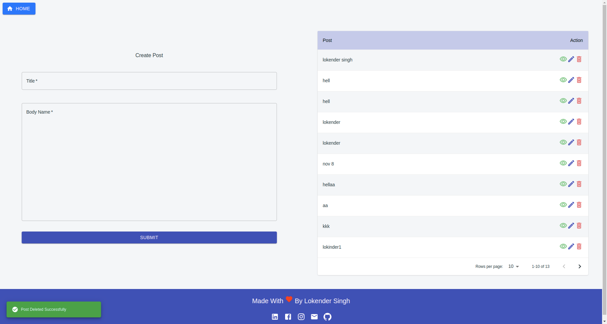
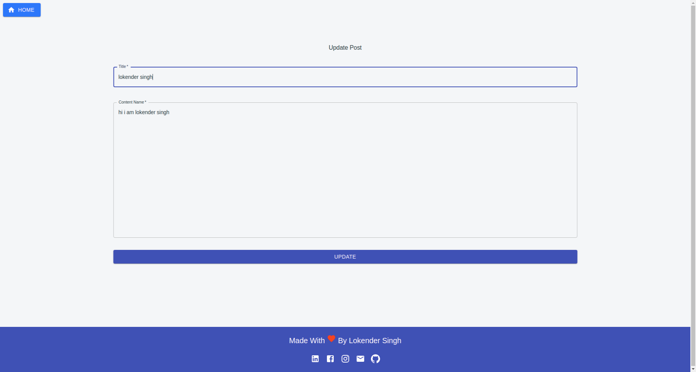
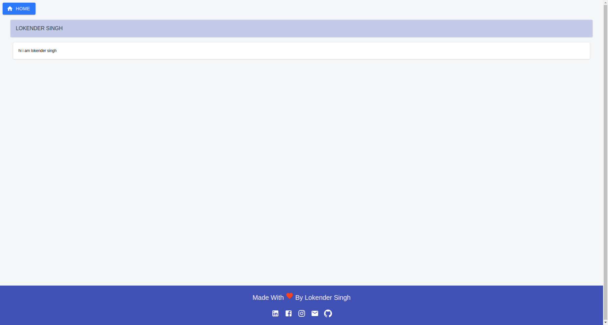

# SIMPLE_MERN_CURD_BLOG_GRAPHQL
It's a simple example or demo project of blog that do basic graphql curd operation
it's made by using following frontend technologies
- ReactJS
- NodeJS
- MongoDB
- ExpressJS
- MaterialUI

## How To Run 
```
- Server
    1. Move To Server Directory
    cd server/

    2. Install Packages
    yarn

    3. start Server App
    nodemon src/server.js 

- Client    

    1. Move To Client Directory
    cd Client/

    2. Install Packages
    yarn

    3. start Server App
    yarn start
```

## Tasks Completed
1. Homepage
2. Create Post
3. Update Post
4. Read Post
5. Delete Post
6. Posts List
7. Mutation Notifications


## Graphql Queries

```
To use on GraphQL Playground
```


1. Create
```
mutation{
  createPost( input:{
	title:"lokender", content:"Hi I am lokinder1"
  }){
    id,
    title,
    content
  }
}

```

2. Update
```
mutation{
  updatePost(_id:"5f984aecb9b08d2b2aa99c73", input:{title:"lokender singh",content:"hi i am lokender singh"}){
    id,
    title,
    content
  }
}

```

3. Read
```
{
  getPost(_id: "5f97e362f5b295bcbd66c28d"){
    id,
    title,
    content
  }
}
```

4. Delete
```
mutation{
  deletePost(_id: "5f984a0db9b08d2b2aa99c72"){
    id,
    title
  }
}
```

5. Read All
```
query{
  getPosts{
    id,
    title,
    content
  }
}

```

## Demo ScreenShots

- Home


- Update


- View
